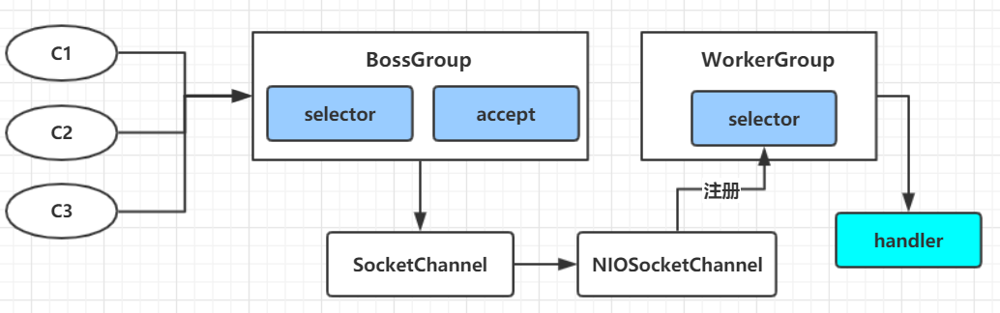
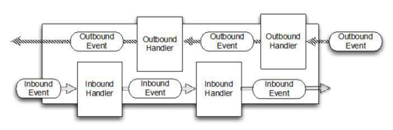

# netty模型与入门案例

## netty工作原理


**netty工作原理简单示意图**:



<br>

1. BossGroup线程维护selector，只关注accept
2. 当接收到accept事件，获取到对应的SocketChannel，封装成NIOSocketChannel并注册到Worker线程（事件循环），并进行维护
3. 当Worker线程监听到selector中通道发生了自己感兴趣的事件后，就由handler进行处理。（此时的handler已经加入到通道）


<br>

**netty-Reactor工作架构图** :


<br>

**具体过程**：

- Netty抽象出两组线程池 **BossGroup** 专门负责接收客户端的连接，**WorkerGroup** 专门负责网络的读写。
- BossGroup 和 WorkerGroup都是 **NioEventLoopGroup** 类型。
- NioEventLoopGroup相当于一个 **事件循环组**，这个组中含有多个事件循环，每个事件循环是 **NioEventLoop**。 
- NioEventLoop 表示一个不断循环的执行处理任务线程，每个 NioEventLoop 都有一个 **selector** ，用于监听绑定在其上的 **socket** 的网络通讯
- 每个 **BossGroup** 循环执行的三个步骤：
  - 轮询 **accept** 事件
  - 处理 **accept** 事件，与client建立连接，生成 **NioSocketChannel**，并将其注册到某个WorkerGroup的NioEventLoop 的 **selector**上。
  - 处理任务队列的任务，即 **runAllTasks**
- 每个 **WorkerGroup** 循环执行三个步骤：
  - 轮询 **read、write** 事件
  - 处理 **io事件**，即read、write 事件，在对应的 **NioSocketChannel** 处理
  - 处理任务队列的任务，即 **runAllTasks**。
- 每个WorkerGroup 的 NioEventLoop 处理业务时，会使用 **pipeline（管道）** ，pipeline中包含了channel，即通过pipeline可以获取到对应通道，管道中维护了很多处理器。

<br>

## 案例

```java
package com.whh.netty.simple;

import io.netty.bootstrap.ServerBootstrap;
import io.netty.channel.*;
import io.netty.channel.nio.NioEventLoopGroup;
import io.netty.channel.socket.SocketChannel;
import io.netty.channel.socket.nio.NioServerSocketChannel;

/**
 * @program: nettyPro
 *
 * @description:
 * @author: wenyan
 * @create: 2019-12-07 21:06
 **/


public class NettyServer {
    public static void main(String[] args) throws Exception{
        //1. 创建两个线程组 BossGroup 和 WorkerGroup
        //2. bossGroup 只是处理连接请求，真正与客户端业务处理，会交给workerGroup完成
        //3. 两个线程组都是无限循环。
        //4. bossGroup 和 workerGroup含有的子线程（NIOEventLoop)的个数 = cpu核数 * 2
        EventLoopGroup bossGroup = new NioEventLoopGroup();
        EventLoopGroup workerGroup = new NioEventLoopGroup();

        try{
            //创建服务器端的启动对象，配置参数
            ServerBootstrap bootstrap = new ServerBootstrap();

            //使用链式编程来进行设置
            bootstrap.group(bossGroup, workerGroup)
                    .channel(NioServerSocketChannel.class)  //使用NioSocketChannel作为服务器的通道实现
                    .option(ChannelOption.SO_BACKLOG, 128)  // 设置线程队列得到连接个数
                    .childOption(ChannelOption.SO_KEEPALIVE, true)  //设置保持活动连接状态
                    //.handler(null)  //该handler对应bossGroup，childHandler对应workerGroup
                    .childHandler(new ChannelInitializer<SocketChannel>() { //创建一个通道初始化对象（匿名对象）
                        //给pipeline设置处理器
                        protected void initChannel(SocketChannel ch) throws Exception {
                            //可以使用一个集合管理 SocketChannel，
                            //再推送消息时，可以将业务加入到各个channel对应的 NIOEventLoop的 taskQueue 或者 scheduleTaskQueue
                            System.out.println("客户端 SocketChannel hashCode=" + ch.hashCode());
                            ch.pipeline().addLast(new NettyServerHandler());
                        }
                    });

            System.out.println("服务器.. is ready");

            //绑定一个端口并且同步，生成了一个ChannelFuture对象
            //启动服务器（并绑定端口）
            final ChannelFuture cf = bootstrap.bind(6668).sync();

            //给cf注册监听器，监听我们关心的事件
            cf.addListener(new ChannelFutureListener() {
                public void operationComplete(ChannelFuture future) throws Exception {
                    if(cf.isSuccess()){
                        System.out.println("监听端口 6668 成功");
                    }else{
                        System.out.println("监听端口 6668 失败");
                    }
                }
            });

            //对关闭通道进行监听
            cf.channel().closeFuture().sync();

        } finally {
            bossGroup.shutdownGracefully();
            workerGroup.shutdownGracefully();
        }
    }

}
```

<br>

```java
package com.whh.netty.simple;

import io.netty.buffer.ByteBuf;
import io.netty.buffer.Unpooled;
import io.netty.channel.Channel;
import io.netty.channel.ChannelHandlerContext;
import io.netty.channel.ChannelInboundHandlerAdapter;
import io.netty.channel.ChannelPipeline;
import io.netty.util.CharsetUtil;

import java.util.concurrent.TimeUnit;


/**
 * @program: nettyPro
 * @description:
 * @author: wenyan
 * @create: 2019-12-07 22:42
 **/

/**
 * ChannelInboundHandlerAdapter:入栈的handler适配器
 * 1. 我们自定义一个handler，需要继承netty规定好的某个handlerAdapter（规范）
 * 2. 这时我们自定义一个handler，才能称为handler
 */
public class NettyServerHandler extends ChannelInboundHandlerAdapter {
    /**
     * 读取数据
     * @param ctx
     * @param msg
     * @throws Exception
     */
    @Override
    public void channelRead(final ChannelHandlerContext ctx, Object msg) throws Exception {

        System.out.println("服务器读取线程："+Thread.currentThread().getName()+"channel = " + ctx.channel());
        System.out.println("server ctx："+ctx);
        System.out.println("channel 和 pipeline的关系:");
        Channel channel = ctx.channel();
        ChannelPipeline pipeline = ctx.pipeline(); //本质是一个双向链表，出栈入栈

        //将msg转成一个ByteBuf
        //ByteBuf 是 netty提供的，不是NIO的ByteBuffer
        ByteBuf buf = (ByteBuf)msg;
        System.out.println("客户端发送的消息是:" + buf.toString(CharsetUtil.UTF_8));
        System.out.println("客户端的地址:" + channel.remoteAddress());
    }

    /**
     * 数据读取完毕
     * @param ctx
     * @throws Exception
     */
    @Override
    public void channelReadComplete(ChannelHandlerContext ctx) throws Exception {
        //writeAndFlush，是write + flush
        //将数据写入到缓存，并刷新
        //一般讲，我们对这个发送的数据进行编码
        ctx.writeAndFlush(Unpooled.copiedBuffer("客户端，你好", CharsetUtil.UTF_8));
    }

    /**
     * 异常处理
     * @param ctx
     * @param cause
     * @throws Exception
     */
    @Override
    public void exceptionCaught(ChannelHandlerContext ctx, Throwable cause) throws Exception {
        ctx.close();
    }
}
```

<br>

```java
package com.whh.netty.simple;

import io.netty.bootstrap.Bootstrap;
import io.netty.channel.ChannelFuture;
import io.netty.channel.ChannelInitializer;
import io.netty.channel.EventLoopGroup;
import io.netty.channel.nio.NioEventLoopGroup;
import io.netty.channel.socket.SocketChannel;
import io.netty.channel.socket.nio.NioSocketChannel;

/**
 * @program: nettyPro
 * @description:
 * @author: wenyan
 * @create: 2019-12-07 23:16
 **/


public class NettyClient {
    private static final String ADDRESS = "127.0.0.1";
    private static final int PORT = 6668;
    public static void main(String[] args) throws InterruptedException {
        //客户端需要一个事件循环
        EventLoopGroup group = new NioEventLoopGroup();

        try {
            //创建客户端启动对象
            //注意客户端使用的不是 ServerBootStrap，而是BootStrap
            Bootstrap bootstrap = new Bootstrap();

            //设置相关参数
            bootstrap.group(group)  //设置线程组
                    .channel(NioSocketChannel.class)    //设置客户端通道的实现类（底层是反射）
                    .handler(new ChannelInitializer<SocketChannel>() {
                        protected void initChannel(SocketChannel ch) throws Exception {
                            ch.pipeline().addLast(new NettyClientHandler()); //加入自己的处理器
                        }
                    });
            System.out.println("客户端启动完成....");

            //启动客户端去连接服务器端
            //ChannelFuture，涉及到netty的异步模型
            ChannelFuture channelFuture = bootstrap.connect(ADDRESS, PORT).sync();

        }finally {
            group.shutdownGracefully();
        }
    }
}
```

<br>

```java
package com.whh.netty.simple;

import io.netty.buffer.ByteBuf;
import io.netty.buffer.Unpooled;
import io.netty.channel.ChannelHandler;
import io.netty.channel.ChannelHandlerContext;
import io.netty.channel.ChannelInboundHandlerAdapter;
import io.netty.util.CharsetUtil;
import io.netty.util.concurrent.EventExecutorGroup;

/**
 * @program: nettyPro
 * @description:
 * @author: wenyan
 * @create: 2019-12-07 23:23
 **/


public class NettyClientHandler extends ChannelInboundHandlerAdapter {
    /**
     * 当通道就绪会触发该方法
     * @param ctx
     * @throws Exception
     */
    @Override
    public void channelActive(ChannelHandlerContext ctx) throws Exception {
        System.out.println("client："+ctx);
        ctx.writeAndFlush(Unpooled.copiedBuffer("你好，服务端..",CharsetUtil.UTF_8));
    }

    /**
     * 当通道有读取事件时，会触发该方法
     * @param ctx：上下文
     * @param msg：消息
     * @throws Exception
     */
    @Override
    public void channelRead(ChannelHandlerContext ctx, Object msg) throws Exception {
        ByteBuf buf = (ByteBuf)msg;
        System.out.println("服务端回复的消息是:"+buf.toString(CharsetUtil.UTF_8));
        System.out.println("服务端的地址是:"+ctx.channel().remoteAddress());
    }

    @Override
    public void exceptionCaught(ChannelHandlerContext ctx, Throwable cause) throws Exception {
        cause.printStackTrace();
        ctx.close();
    }
}
```

<br>

## netty任务队列中的Task三种使用场景

在上述的代码中，加入一个客户端任务请求需要处理的时间非常长，那么服务端会阻塞着等待处理完毕才会轮到下一个。这个显然是不可取的。

那么，假如有一个耗时非常长的业务，我们可以把任务放到channel对应的NioEventLoop的taskQueue中。

可以有三种方法：

<br>

### 1. 用户程序自定义普通队列


```java
 @Override
 public void channelRead(final ChannelHandlerContext ctx, Object msg) throws Exception {    
	//比如这里有一个非常耗时长的业务
    //通过 异步执行 --> 提交到该channel对应的NIOEventLoop的taskQueue中
    //方案一：用户程序自定义的普通任务
    ctx.channel().eventLoop().execute(new Runnable() {
        public void run() {
            try {
                Thread.sleep(5*1000);
                ctx.writeAndFlush(Unpooled.copiedBuffer("hello,客户端111",CharsetUtil.UTF_8));
                System.out.println("channel code=" + ctx.channel().hashCode());
            }catch (Exception ex){
                ex.printStackTrace();
            }
        }
    });

    ctx.channel().eventLoop().execute(new Runnable() {
        public void run() {
            try {
                Thread.sleep(5*1000);
                ctx.writeAndFlush(Unpooled.copiedBuffer("hello，客户端222",CharsetUtil.UTF_8));
                System.out.println("channel code="+ctx.channel().hashCode());
            }catch (Exception ex){
                ex.printStackTrace();
            }
        }
    });
}
```


### 2. 用户自定义定时任务

```java
 @Override
    public void channelRead(final ChannelHandlerContext ctx, Object msg) throws Exception {
     //方案二：用户自定义定时任务 --> 该任务是提交到scheduleTaskQueue
        ctx.channel().eventLoop().schedule(new Runnable() {
            public void run() {
                try {
                    Thread.sleep(5*1000);
                    ctx.writeAndFlush(Unpooled.copiedBuffer("hello,客户端3",CharsetUtil.UTF_8));
                    System.out.println("channel code="+ctx.channel().hashCode());
                }catch (Exception ex){
                    ex.printStackTrace();
                }
            }
        },5,TimeUnit.SECONDS);    
    }
```


### 3. 非当前Reactor线程调用Channel的各种方法

例如在 **推送系统** 的业务线程里面，根据 **用户的标识**，找到对应的 **Channel引用**，然后调用Write类方法向该用户推送消息，就会进入到这种场景。最终的Write会提交到任务队列中后被 **异步消费**。


<br>


## 异步模型与Future-Listener机制

- 异步的概念和同步相对。当一个异步过程调用发出后，调用者不能立刻得到结果。实际处理这个调用的组件在完成

  后，通过状态、通知和回调来通知调用者。

- Netty 中的 I/O 操作是异步的，包括 Bind、Write、Connect 等操作会简单的返回一个 ChannelFuture。

- 调用者并不能立刻获得结果，而是通过 Future-Listener 机制，用户可以方便的主动获取或者通过通知机制获得 IO 操

  作结果

- Netty 的异步模型是建立在 future 和 callback 的之上的。callback 就是回调。重点说 Future，它的核心思想是：假设

  一个方法 fun，计算过程可能非常耗时，等待 fun返回显然不合适。那么可以在调用 fun 的时候，立马返回一个 

  Future，后续可以通过 Future去监控方法 fun 的处理过程(即 ： Future-Listener 机制)

<br>

### Future 说明

表示异步的执行结果, 可以通过它提供的方法来检测执行是否完成，比如检索计算等等.
ChannelFuture 是一个接口 ： public interface ChannelFuture extends Future<Void>我们可以添加监听器，当监听的事件发生时，就会通知到监听器。

<br>

### 异步模型工作原理



**说明:** 

在使用 Netty 进行编程时，拦截操作和转换出入站数据只需要您提供 callback 或利用future 即可。这使得链式操作简单、高效, 并有利于编写可重用的、通用的代码。

Netty 框架的目标就是让你的业务逻辑从网络基础应用编码中分离出来、解脱出来。

<br>

### Future-Listener 机制

当 Future 对象刚刚创建时，处于非完成状态，调用者可以通过返回的 ChannelFuture 来获取操作执行的状态，注册监听函数来执行完成后的操作。

**常见有如下操作**:

- 通过 isDone 方法来判断当前操作是否完成；(该操作有可能成功或失败)
- 通过 isSuccess 方法来判断已完成的当前操作是否成功；
- 通过 getCause 方法来获取已完成的当前操作失败的原因；
- 通过 isCancelled 方法来判断已完成的当前操作是否被取消；
- 通过 addListener 方法来注册监听器，当操作已完成(isDone 方法返回完成)，将会通知指定的监听器；如果 Future 对象已完成，则通知指定的监听器

<br>

### 案例

像我们在上面代码的NettyServer中的ChannelFuture。

//绑定一个端口并且同步，生成了一个ChannelFuture对象
            //启动服务器（并绑定端口）
            final ChannelFuture cf = bootstrap.bind(6668).sync();

```java
		//绑定一个端口并且同步，生成了一个ChannelFuture对象
		//启动服务器（并绑定端口）
		final ChannelFuture cf = bootstrap.bind(6668).sync();     
		//给cf注册监听器，监听我们关心的事件
		cf.addListener(new ChannelFutureListener() {
            public void operationComplete(ChannelFuture future) throws Exception {
                if(cf.isSuccess()){
                    System.out.println("监听端口 6668 成功");
                }else{
                    System.out.println("监听端口 6668 失败");
                }
            }
        });

        //对关闭通道进行监听
        cf.channel().closeFuture().sync();
```
<br>

