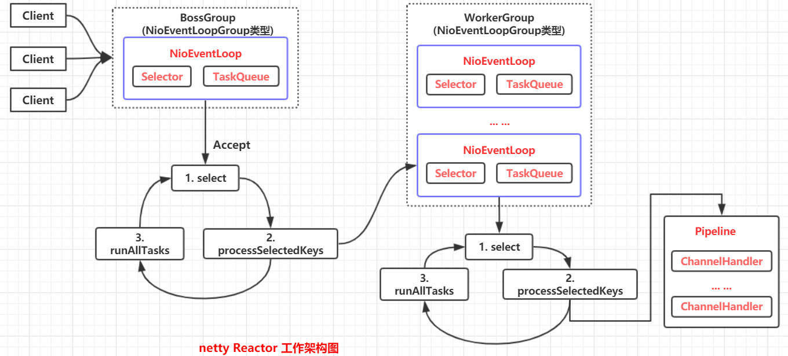

# netty模型与入门案例

**netty-Reactor工作架构图** :

 

**具体过程**：

- Netty抽象出两组线程池 **BossGroup** 专门负责接收客户端的连接，**WorkerGroup** 专门负责网络的读写。
- BossGroup 和 WorkerGroup都是 **NioEventLoopGroup** 类型。
- NioEventLoopGroup相当于一个 **事件循环组**，这个组中含有多个事件循环，每个事件循环是 **NioEventLoop**。 
- NioEventLoop 表示一个不断循环的执行处理任务线程，每个 NioEventLoop 都有一个 **selector** ，用于监听绑定在其上的 **socket** 的网络通讯
- 每个 **BossGroup** 循环执行的三个步骤：
  - 轮询 **accept** 事件
  - 处理 **accept** 事件，与client建立连接，生成 NioSocketChannel，并将其注册到某个WorkerGroup的NioEventLoop 的 selector上。
  - 处理任务队列的任务，即 **runAllTasks**
- 每个 **WorkerGroup** 循环执行三个步骤：
  - 轮询 **read、write** 事件
  - 处理 **io事件**，即read、write 事件，在对应的 **NioSocketChannel** 处理
  - 处理任务队列的任务，即 **runAllTasks**。
- 每个WorkerGroup 的 NioEventLoop 处理业务时，会使用 **pipeline（管道）** ，pipeline中包含了channel，即通过pipeline可以获取到对应通道，管道中维护了很多处理器。

 

